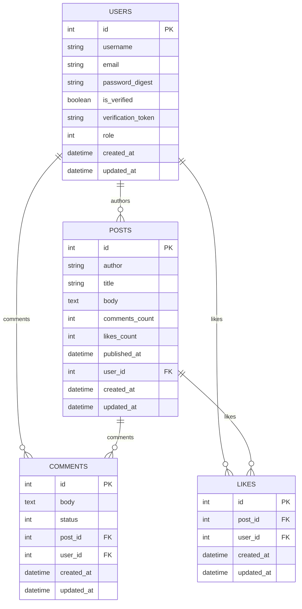

# Blog API

A Ruby on Rails backend API for managing blog content, designed with a single-admin authorization model. The system uses JWT-based authentication and intentionally centralizes all write access to a designated administrator while keeping read access public.

This system separates authorship from publishing, ensures public read access, and enforces strict admin control over content changes.

---

## Core Features

- **JWT Authentication:** Stateless session management for secure user access.
- **Admin-Only Write Operations:** `POST`, `PUT/PATCH`, `DELETE` endpoints are protected for admin users only.
- **Public Read Access:** Optimized `GET` endpoints for content consumption without authentication.
- **Delegated Authorship Model:** Admin can publish posts and assign content to any `user_id`, separating the Publisher role from the Author role.

## Security & Authorization Model

**1. Verification Gate**
- Users must have `is_verified: true` in the database to authenticate.
- Prevents unapproved accounts from obtaining JWTs.

**2. Authorization Logic**
- Admin routes are protected by a centralized filter:
```ruby
# app/controllers/application_controller.rb
def authorize_admin
  render json: { error: 'Admin access required' }, status: :forbidden unless current_user&.admin?
end
```

- **Non-Admin JWT**: 403 Forbidden
- **Malformed/Missing JWT**: 401 Unauthorized


**3. Ownership Logic**
- Admin can permit `user_id` in `post_params` to act as a CMS Editor.
- Maintains relational integrity while allowing team content publishing.

 ---

## Database Schema
- Relational PostgreSQL structure
- Optimized for blog content and multi-user interactions



---

## Testing Suite
This API is backed by a comprehensive integration test suite that ensures security, authorization, and functionality.

Coverage Highlights:

- **Public Access**
    - Confirms anyone can read posts without authentication (`GET /posts`, `GET /posts/:id`).
- **Unauthorized Access**
    - Ensures non-admin users cannot create, update, or delete posts.
    - Validates correct HTTP responses (`401 Unauthorized`) and that database remains unchanged.
- **Authorized Admin Access**
    - Validates admin JWT login flow (`POST /login`).
    - Confirms admin can create and update posts.
    - Checks ownership logic: admin can assign posts to any user_id.
- **Security Assertions**
    - Only is_verified users can authenticate
    - Admin-only routes are protected (`403 Forbidden` for unauthorized users)
    - Malformed or missing tokens return `401 Unauthorized`

```bash
# Run all tests
rails test
```
Example: The `PostAuthorizationTest` class simulates real API requests for public, unauthorized, and admin users, ensuring authentication and authorization rules are enforced end-to-end.

## Tech Stack
- Ruby 3.4.2
- Rails 8.1.1
- PostgreSQL
- JWT for stateless authentication


## Setup Instructions

1. Clone the repository:
    ```
    git clone https://github.com/rabebe/blog-api
    cd blog-api
    ```

2. Install dependencies:

    ```
    bundle install
    ```

3. Configure Environment Variables: Create a .env file in the root directory. This file is used to configure the identity of the single administrative user, whose ID the application uses for authorization checks.

    Note on Secrets: The `SECRET_KEY_BASE` for JWT encryption is handled automatically by Rails using the encrypted credentials file (credentials.yml.enc).

    ```# .env file content
    # The email and password used to identify and seed the single Admin user
    ADMIN_EMAIL=admin@example.com
    ADMIN_PASSWORD=supersecurepassword
    ```

4. Database Setup:

    ```
    rails db:create
    rails db:migrate
    rails db:seed
    ```

5. Run the Server:

    ```
    rails server
    ```

### Database Operations

A custom Rake task is available for reliably resetting the Post data without affecting other tables like Users. This is highly useful for resetting development or staging environments to a known baseline.

| Command | Purpose |
|---------|---------|
| rails db:safe_reseed | Safe Reset: Deletes all records from the posts table, resets the primary key ID counter back to 1, and re-runs the db/seeds.rb file to create fresh posts. |


## API Endpoints

The base URL for the API is assumed to be http://localhost:3000 locally.

| Method | Endpoint | Description | Auth Required |
|-------------|------|-------------|------------------------|
| POST | /signup | Register a new account | None
| GET | /verify-email | Required to activate account | Token in URL
| POST | /login | Receive JWT (Only if verified) | Valid Credentials
| GET | /posts | List of all posts. | None
| GET | /posts/:id | Retrieves a specific post | None
| POST | /posts | Creates a new post | Admin JWT
| PUT/PATCH | /posts/:id | Updates an existing post | Admin JWT 
| DELETE | /posts/:id | Deletes a specific post | Admin JWT
| POST | /posts/:id/comments | Adds a comment to a post | User JWT
| PATCH | /admin/comments/:id | Moderates a comment | Admin JWT

## Example: Create Post as Admin
Headers:
```
Authorization: Bearer [Admin's JWT Token]
Content-Type: application/json
```

Body:
```
{
  "post": {
    "title": "A New Article",
    "body": "This was published by the Admin but authored by User 99.",
    "user_id": 99 
  }
}
```

## Security Considerations
- Admin-only operations prevent accidental or malicious data changes
- JWT + verification ensures only valid users can perform sensitive actions
- Ownership model separates publisher vs author responsibilities for team collaboration
- Tested end-to-end to ensure all authentication and authorization rules are enforced

---

## License
This project is licensed under the MIT License - see the LICENSE file for details.