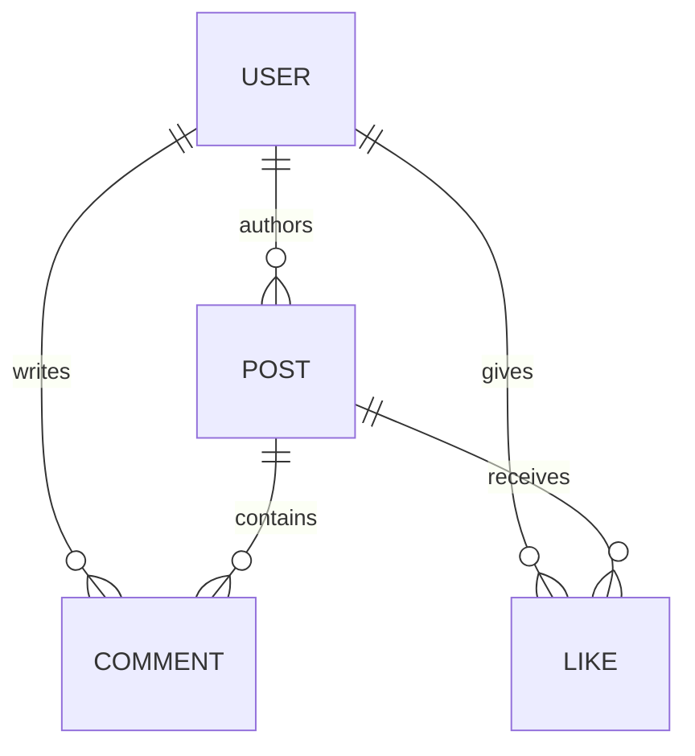
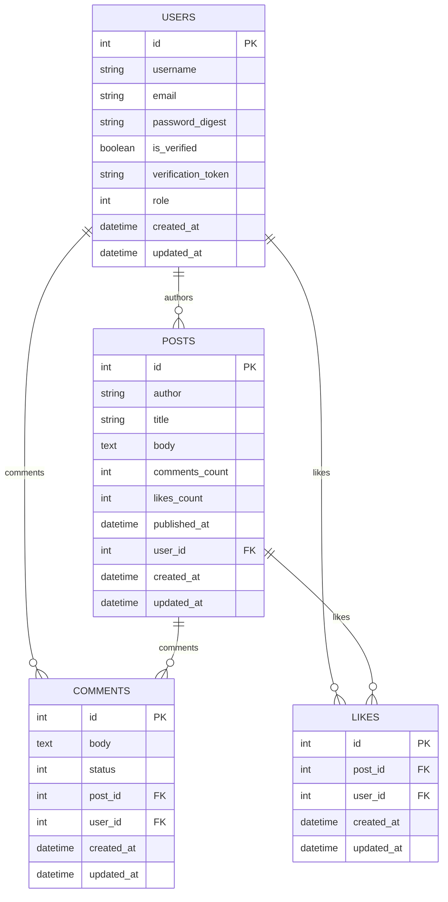

# Headless Blog Engine (CMS API)

## Project Overview
This project is a production-ready **Headless CMS API** built with Ruby on Rails. It manages a complex relational data model with hierarchical interactions (comments, likes) and enforces a strict **Role-Based Access Control (RBAC)** security layer.

Designed for low-latency content delivery, this backend powers modern decoupled frontends (Next.js, Mobile) with a focus on data integrity, cost-aware performance, and administrative flexibility.

---

## System Architecture

The system follows a **decoupled middleware pattern**, serving as a single source of truth for multiple client types while maintaining high performance through strategic engineering choices:

* **Counter-Caches:** We store `likes_count` and `comments_count` directly on the `Post` record. This trades a small amount of write-time performance for **$O(1)$ read-time performance**, eliminating N+1 query overhead in post listings.
* **JWT Auth with RBAC:** Using stateless JWTs allows for horizontal scaling. We enforce RBAC via a custom `authorize_admin` filter to prevent unauthorized data modification and IDOR attacks.
* **Markdown Persistence:** Content is stored as Markdown rather than HTML, reducing database bloat and providing the frontend total control over rendering styles.
* **Delegated Authoring:** The Admin can assign posts to any `user_id` safely, allowing for a "Managed CMS" workflow where an administrator handles content entry for multiple authors.

---

## Key Features
* **Secure Authentication:** JWT-based identity verification with credential masking via environment variables.
* **Tiered Permissions:** Strict separation between Public (Read), Authenticated (Interact), and Admin (Manage) roles.
* **Social Engagement Graph:** Native support for likes and threaded user comments.
* **Optimized Serialization:** Custom JSON shapes that include "interaction flags" (e.g., `user_liked: true`) to simplify frontend rendering logic.
* **Maintenance Tools:** Custom Rake tasks for safe database reseeding without affecting core user tables.

---

## User Authentication & Permissions

### Authentication Flow
The API uses **JWT-based identity verification**. Upon login, the client receives a token which must be included in the `Authorization` header for all protected endpoints.

| Action | Public | Authenticated User | Admin |
| :--- | :---: | :---: | :---: |
| View Posts/Comments | ✅ | ✅ | ✅ |
| Like / Comment | ❌ | ✅ | ✅ |
| Create / Edit / Delete Posts | ❌ | ❌ | ✅ |
| Approve / Moderate Content | ❌ | ❌ | ✅ |

---

## API Design

### Endpoint Example: Fetching Content
`GET /api/posts/3`

**Sample JSON Response**
```json
{
  "id": 3,
  "title": "Scaling Rails APIs",
  "body": "## Strategy 1: Counter Caches...",
  "author": { "username": "dev_lead", "role": "admin" },
  "stats": {
    "likes": 124,
    "comments": 12
  },
  "current_user_context": {
    "liked": true,
    "can_edit": false
  }
}
```

### Primary endpoints
| Method | Path | Description | Auth Required |
| :---: | :--- | :--- | :---: |
| GET | /api/posts | List all posts with pagination | No | |
| GET | /api/posts/:id | Get a single post with comments and like status | | No |
| POST | /api/posts | Create a new post | Yes |
| PUT | /api/posts/:id | Update a post | Yes |
| DELETE | /api/posts/:id | Delete a post | Yes |
| POST | /api/posts/:id/like | Like a post | | Yes |
| POST | /api/posts/:id/comments | Submit a comment | Yes |

## Data Schema & ERD


- **Non-Admin JWT**: 403 Forbidden
- **Malformed/Missing JWT**: 401 Unauthorized


**3. Ownership Logic**
- Admin can permit `user_id` in `post_params` to act as a CMS Editor.
- Maintains relational integrity while allowing team content publishing.

 ---

## Database Schema
- Relational PostgreSQL structure
- Optimized for blog content and multi-user interactions



---

## Testing Suite
This API is backed by a comprehensive integration test suite that ensures security, authorization, and functionality.

Coverage Highlights:

- **Public Access**
    - Confirms anyone can read posts without authentication (`GET /posts`, `GET /posts/:id`).
- **Unauthorized Access**
    - Ensures non-admin users cannot create, update, or delete posts.
    - Validates correct HTTP responses (`401 Unauthorized`) and that database remains unchanged.
- **Authorized Admin Access**
    - Validates admin JWT login flow (`POST /login`).
    - Confirms admin can create and update posts.
    - Checks ownership logic: admin can assign posts to any user_id.
- **Security Assertions**
    - Only is_verified users can authenticate
    - Admin-only routes are protected (`403 Forbidden` for unauthorized users)
    - Malformed or missing tokens return `401 Unauthorized`

```bash
# Run all tests
rails test
```
Example: The `PostAuthorizationTest` class simulates real API requests for public, unauthorized, and admin users, ensuring authentication and authorization rules are enforced end-to-end.

## Tech Stack
- Ruby 3.4.2
- Rails 8.1.1
- PostgreSQL
- JWT for stateless authentication


## Setup Instructions

1. Clone the repository:
    ```
    git clone https://github.com/rabebe/blog-api
    cd blog-api
    ```

2. Install dependencies:
    ```
    bundle install
    ```

3. Configure Environment Variables: Create a .env file in the root directory. This file is used to configure the identity of the single administrative user, whose ID the application uses for authorization checks.

    Note on Secrets: The `SECRET_KEY_BASE` for JWT encryption is handled automatically by Rails using the encrypted credentials file (credentials.yml.enc).

    ```# .env file content
    # The email and password used to identify and seed the single Admin user
    ADMIN_EMAIL=admin@example.com
    ADMIN_PASSWORD=supersecurepassword
    ```

4. Database Setup:

    ```
    rails db:create
    rails db:migrate
    rails db:seed
    ```

5. Run the Server:

    ```
    rails server
    ```

### Database Operations

A custom Rake task is available for reliably resetting the Post data without affecting other tables like Users. This is highly useful for resetting development or staging environments to a known baseline.

| Command | Purpose |
|---------|---------|
| rails db:safe_reseed | Safe Reset: Deletes all records from the posts table, resets the primary key ID counter back to 1, and re-runs the db/seeds.rb file to create fresh posts. |
